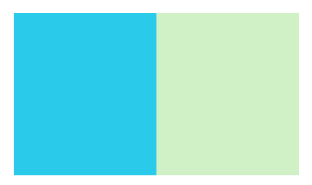

# Atividade-canvas
Gustavo Henrique Moraes Rocillo e Cauã Magalhães  
Este projeto utiliza o canvas para criar formas geometricas e imagens. 

# Retângulo

"fillStyle" é usado para selecionar a cor que será utilizada. 
"fillRect" é o método que desenha o retângulo preenchido com a cor previamente selecionada e onde selecionamos a área que será preenchida. 

# Círculo

"arc" é o método usado para criar círculos. 
"stroke" é o método que adiciona linhas. 
"strokeStyle" é usado para selecionar a cor que será utilizada na linha. 
"fill" é utilizado para preencher o espaço interno. 
"lineWidth" aumenta a espessura da linha. 

# Linha 

"moveTo" é o método onde selecionamos um ponto específico no canvas. 
"lineTo" cria uma linha entre os pontos escolhidos. 

# Curva

"quadraticCurveTo" após fazer a linha este metodo e usado para desenhar uma curva. Ele requer três parâmetros: as coordenadas x e y do ponto de controle e as coordenadas x e y do ponto final da curva. 

# Imagem

"onload" cria um evento de carregamento para a imagem e a funcao definida sera executada quando a imagem for carregada. 
"drawnImage"é usado para desenhar uma imagem em um elemento canvas.  